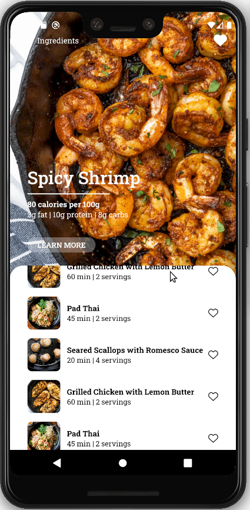

<h1 align="center">Recipes App</h1>

<p align="center">Aplicação desenvolvida para reforçar conhecimentos sobre styled-components.</p>

<h1 align="center">
  
</h1>

### 🛠 Tecnologias

As seguintes ferramentas foram usadas na construção do projeto:

- [Node.js](https://nodejs.org/en/)
- [React Native](https://reactnative.dev/)
- [TypeScript](https://www.typescriptlang.org/)

### Pré-requisitos

Antes de começar, você vai precisar ter instalado em sua máquina as seguintes ferramentas:
[Git](https://git-scm.com), [Node.js](https://nodejs.org/en/).
Além disto é bom ter um editor para trabalhar com o código como [VSCode](https://code.visualstudio.com/)

### 🎲 Rodando aplicação

```bash
# Clone este repositório
$ git clone <https://github.com/viniciusmoreira/recipes_app>

# Acesse a pasta do projeto no terminal/cmd
$ cd recipes_app

# Instale as dependências
$ npm install

# Execute a aplicação em modo de desenvolvimento
$ npm android
```

---

## Autor

 
 <br />
 <sub><b>Vinícius Moreira</b></sub>
 <br />
 <br />


## 📝 Licença

Este projeto esta sobe a licença [MIT](./LICENSE).

Feito por Vinicius Moreira [Entre em contato!](https://www.linkedin.com/in/vinicius-moreira-vm/)
